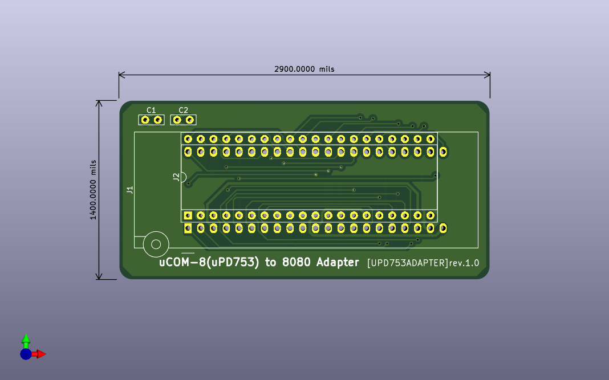

# uPD753adapter
Adapter for NEC uPD753 to convert to Intel 8080 pinout.

## 概要
- NEC uPD753を8080のピン配列にするためのアダプタです．

## 基板

- 実物

### BOM
|Reference          |Qty| Value          |Memo |
|-------------------|---|----------------|-----|
|C1,C2              |2  |0.1uF           |     |
|J1                 |1  |42pin ZIF Socket|uPD753用ソケット |
|J2                 |1  |40pinの何か     |8080側端子 |

## 動作例
- [TangNano8080MEM](https://github.com/ryomuk/tangnano-5V/tree/main/applications/TangNano8080MEM)に載せてみたところ，問題無く動作しました．

## 関連情報
- uCOM-8 [www.st.rim.or.jp/~nkomatsu/nec/uPD753.html](http://www.st.rim.or.jp/~nkomatsu/nec/uPD753.html)
- NEC μCOMシリーズ総合ユーザーズガイド 1978 SUMMER pp.32-33

## 更新履歴
- 2024/09/09: 初版公開

